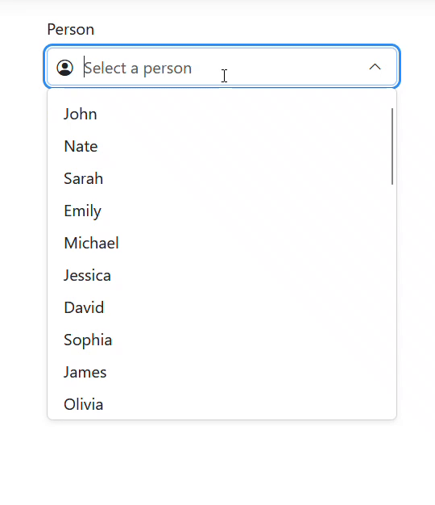

# Getting Started
1. Install the TurnisUITest Nuget package.<br/>
2. Add the following to your ```_ViewImports.cshtml```
```
@addTagHelper *, TestUI
```
3. Include the required stylesheet and script to your ```_Layout.cshtml``` inside of the ```<head>``` tag
```
<link rel="stylesheet" href="/_content/TurnisUITest/css/testui.css" asp-append-version="true"/> 
<script type="module" src="/_content/TurnisUITest/js/Base.js"></script>
```


# Components
[AutoComplete](#autocomplete) <br />
[Select](#select)


## AutoComplete
**An input that allows users to search and select from a list of items.**
<details>
  <summary>Demo</summary>
  
  
  
</details>

### Usage
```
<nt-autocomplete id="MyFirstAutocomplete"
                 label="Person"
                 placeholder="Select a person"
                 items="Model.People"
                 value-property="Id"
                 display-property="FirstName" />
```
In the above example, we declare the AutoComplete that uses a ```List<People>``` as the data source. We specify the property name in the ```People``` class to use as the selected item's value (```Id```) and the text (```FirstName```) to show in the dropdown list.
> [!IMPORTANT]
> When <code>Items</code> is provided, a <code>value-property</code> must be specified.

### Getting the Selected Value
The selected value will be serialized in a form with the name based on the required ```id``` property.<br/>
You can also grab the value in JavaScript like a normal ```<input />``` tag:
```
let val = $("#MyFirstAutocomplete").val();
```

### Server Searching
By specifying a ```search-url```, the AutoComplete will send a request to the endpoint with the user's input. This request is after the time specified in ```search-delay``` (150ms default). You can also specify to ```fetch-server-on-load``` to fetch the endpoint with a blank string right when the component is loaded on the page.
```
<nt-autocomplete id="MyFirstAutocomplete2"
                 label="Person"
                 placeholder="Select person"
                 value-property="Id"
                 display-property="FirstName"
                 search-url="/Home/SearchPeople"
                 virtualize />
```

<details>
<summary>View Controller Method</summary>
  The AutoComplete sends in 1 parameter of name <code>searchVal</code> with the user's input. We then can do filtering and return a <code>Json()</code> result with the list of the same data type.
  
```
public IActionResult SearchPeople(string? searchVal)
{
    if (searchVal == null) return Json(model);

    Thread.Sleep(2000); // Simulate database call

    searchVal= searchVal.Trim();
    List<Person> result = model.Where(x => x.FirstName.Contains(searchVal, StringComparison.CurrentCultureIgnoreCase)).ToList();
    // or do some db calls with filtering ...

    return Json(result);
}
```
</details>

> [!TIP]
> Increasing ```search-delay``` and enabling virtualization with ```virtualize``` can help improve performance.

### Parameters
| Parameter Name  | Type | Default | Description |
| ------------- | ------------- | ------------- | ------------- |
| ```disabled``` | bool | false | Disable the input and dropdown toggles. |
| ```display-property``` | string | null | The property each item will use as its display text. |
| ```dropdown-size``` | int | 330 | The maxium size of the rendered dropdown in pixels. |
| ```fetch-server-on-load``` | bool | false | When the component is initialized, a call is made to ```search-url``` with an empty value. |
| ```floating-label``` | bool | false | Use Bootstrap's floating labels. A label and placeholder is required. |
| ```id```  | string | null | The ID to for the AutoComplete. Used to grab the value. |
| ```items``` | ```IEnumerable``` of string,<br/> int,<br/> object | null | A list of items to bind this AutoComplete to.<br/> Required when no ```search-url``` is defined. |
| ```label``` | string | null | The label for the input. |
| ```placeholder``` | string | null | The placeholder to display when nothing is selected or inputted. |
| ```required``` | bool | false | Make this AutoComplete required in forms. |
| ```search-delay``` | int | 150 | The time in milliseconds from when input is received to when the search is made. |
| ```search-url``` | string | null | The URL (typically a controller action) to fetch data upon input.<br/>A parameter <code>string searchVal</code> is required in the controller method.<br/><sub>Ex: "/Home/SearchPeople"<br/></sub> |
| ```size``` | small,<br/>medium,<br/>large | medium | The size of the rendered input. |
| ```start-icon``` | string | null | Icon to show in front of input. Only accepts Bootstrap's Icon Web Font class name. <br/> For example: bi bi-microsoft |
| ```value``` | string,<br/>int,<br/>object | null | The inital value given to the AutoComplete.<br/> Depending on the given ```items```, it can be a primitive or an object. |
| ```value-property``` | string | null | The property for which each item's value is set to.<br/> This is the value sent upon form submission. |
| ```virtualize``` | bool | false | Virtualizes the list so only visible items are rendered to improve performance on large datasets. |


## Select
**An input that allows users to select from a list of items.**

### Usage
```
<nt-select id="MySelect" label="Person" placeholder="Select a person...">
    @foreach(var person in Model.People) {
        <nt-select-item value="@person.Id">@person.FirstName @person.LastName</nt-select-item>
    }
</nt-select>
```
The syntax resembles a regular HTML ```<select>``` tag. We can provide a ```placeholder``` string instead of a hidden select item for a non-floating select. 

```
<nt-select id="MySelect" label="Person" placeholder="Select a person...">
    @foreach(var person in Model.People) {
        <nt-select-item selected="@(person.Id == 3)" value="@person.Id">@person.FirstName @person.LastName</nt-select-item>
    }
</nt-select>
```
Here, we specify the default selected item.

### Getting the Selected Value
The selected value will be serialized in a form with the name based on the required ```id``` property.<br/>
You can also grab the value in JavaScript like a normal ```<select>``` tag:
```
let val = $("#MyFirstAutocomplete").val();
```
### Grouping Items
You can also group items together.
```
<nt-select id="MySelect" label="Food" placeholder="Select a food...">
    <nt-select-optgroup label="Fruits">
        <nt-select-item value="@("Apple")">Apple</nt-select-item>
        <nt-select-item value="@("Banana")">Banana</nt-select-item>
        <nt-select-item value="@("Orange")">Orange</nt-select-item>
        <nt-select-item value="@("Watermelon")">Watermelon</nt-select-item>
    </nt-select-optgroup>
    <nt-select-optgroup label="Vegetables">
        <nt-select-item value="@("Broccoli")">Broccoli</nt-select-item>
        <nt-select-item value="@("Carrot")">Carrot</nt-select-item>
        <nt-select-item value="@("Lettuce")">Lettuce</nt-select-item>
        <nt-select-item value="@("Potato")">Potato</nt-select-item>
    </nt-select-optgroup>
</nt-select>
```


